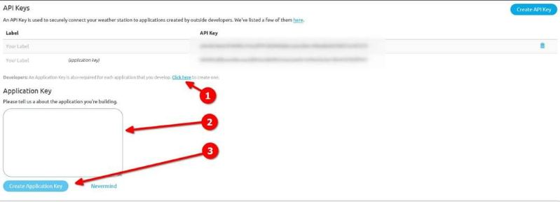
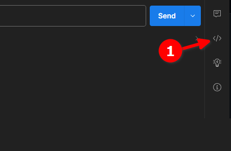
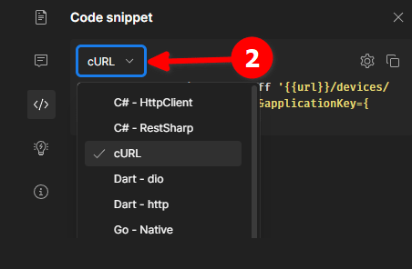
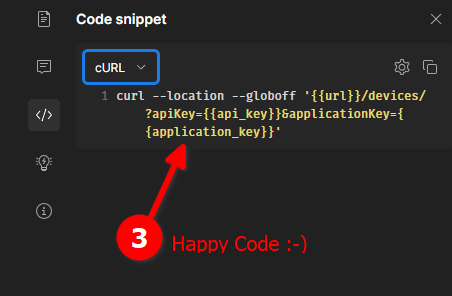

# ambient_api_postman_collection

A [Postman](https://www.postman.com/) collection for the Ambient Weather API

```
   I am not affiliated with Ambient Weather. 
   I am just an enthusiastic developer who loves to help out. 
   
   Some of what you see below is borrowed from the official documentation 
   (ex: "our servers") and I make no claim to ownership.
```

# Ambient Weather

##### This local documentation is a copy of [https://ambientweather.docs.apiary.io/#]() please refer to that link for the most up-to-date information.

I have omitted the connector library list. You can generate code for just about any language right from Postman.

## Authentication

Two API Keys are required for all REST API requests:

- `applicationKey` - identifies the developer / application. To create an application key please login to your
  AmbientWeather.net [account page](https://ambientweather.net/account)
  

- `apiKey` - grants access to past/present data for a given user's devices. A typical consumer-facing application will
  initially ask the user to create an `apiKey` on their
  AmbientWeather.net [account page](https://ambientweather.net/account) and paste it into the app.

  _Developers for personal or in-house apps will also need to create an apiKey on their own account page._

## Rate Limiting

API requests are capped at 1 request/second for each user's apiKey and 3 requests/second per applicationKey. When this
limit is exceeded, the API will return a 429 response code. Please be kind to our servers :smiley:

## Data Timing

The devices returned from the `/devices` endpoint contain a `lastData` parameter that contains the most up-to-date data
we have for the device. Most devices update every minute, some update less frequently. The timestamps are rounded to the
nearest minute.

Queries for past data using the `/devices/:macAddress`  
endpoint are returned in 5 minute or 30 minute increments. There can be  
up to a 10 minute delay before the most recent data becomes available.  
If you need up-to-the-minute data please use the `/devices` endpoint or _forthcoming_ realtime API.

## HTTP Response Codes

(non-comprehensive list - just the ones I've seen)

| Code | Definition                         |
|------|------------------------------------|
| 200  | Success - You should get data back |
| 429  | Rate Limit Exceeded                |
| 401  | Invalid API Key                    |

## Other Resources

- API Wiki - [https://github.com/ambient-weather/api-docs/wiki](https://github.com/ambient-weather/api-docs/wiki)
- Device Data Specifications: [https://github.com/ambient-weather/api-docs/wiki/Device-Data-Specs](https://github.com/ambient-weather/api-docs/wiki/Device-Data-Specs)
- My other Ambient Weather Code
    - [Python Library](https://github.com/avryhof/ambient_api) - ambient_api
    - [Ambient APRS Python Library](https://github.com/avryhof/ambient_aprs) - ambient_aprs

# API Functions

## GET: Devices

- https://api.ambientweather.net/v1/devices/?apiKey={{api_key}}&applicationKey={{application_key}}

Provides a list of the user's available devices along with each device's most recent data.

#### Query Params

| Parameter      | Value               | Notes                             |
|----------------|---------------------|-----------------------------------|
| apiKey         | {{api_key}}         | [Authentication](#authentication) |
| applicationKey | {{application_key}} | [Authentication](#authentication) |          

## GET: Device Data

- https://api.ambientweather.net/v1/devices/{{macAddress}}?apiKey={{api_key}}&applicationKey={{application_key}}&limit=1&end_date=1691587233

Fetch data for a given device. Data is stored in 5 or 30 minute increments.

- A list of all possible fields is here: [https://github.com/ambient-weather/api-docs/wiki/Device-Data-Specs](https://github.com/ambient-weather/api-docs/wiki/Device-Data-Specs)

#### Query Params

| Parameter      | Value / default     | Notes                                                                         |
|----------------|---------------------|-------------------------------------------------------------------------------|
| apiKey         | {{api_key}}         | [Authentication](#authentication)                                             |
| applicationKey | {{application_key}} | [Authentication](#authentication)                                             |
| limit          | 1                   | max = 288                                                                     |
| end_date       | 1691587233          | [epoch in milliseconds](https://currentmillis.com/)  (click for code samples) |

# Make it code for me!

Yes, that's what I said!

[Postman](https://www.postman.com/) will generate code for you in dozens of languages.

It won't write your whole application for you, but it helps to see how it all works.

1. Choose Code Snippet from the icon bar on the right

   

2. Select a language from the dropdown selector

   

3. Bask in the presence of code that works, but you'll probably want to tweak

   

